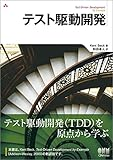
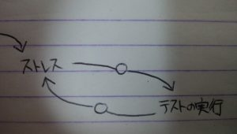

テスト駆動開発（TDD）についてはある程度知っているつもりだったのですが、改めて原典に触れようと思い、読み進めました。きっかけは以下の記事にまとめたように、和田和人さん([@t\_wada](https://twitter.com/t_wada))が訳しているのを聞いたからでした。

http://localhost/event-report/t-wada

読んだ本はこちらです。

[テスト駆動開発](//af.moshimo.com/af/c/click?a_id=1041250&p_id=170&pc_id=185&pl_id=4062&s_v=b5Rz2P0601xu&url=https%3A%2F%2Fwww.amazon.co.jp%2Fexec%2Fobidos%2FASIN%2F4274217884)

posted with [ヨメレバ](https://yomereba.com)

Kent Beck オーム社 2017-10-14

[Amazon](//af.moshimo.com/af/c/click?a_id=1041250&p_id=170&pc_id=185&pl_id=4062&s_v=b5Rz2P0601xu&url=https%3A%2F%2Fwww.amazon.co.jp%2Fexec%2Fobidos%2FASIN%2F4274217884)

[Kindle](//af.moshimo.com/af/c/click?a_id=1041250&p_id=170&pc_id=185&pl_id=4062&s_v=b5Rz2P0601xu&url=https%3A%2F%2Fwww.amazon.co.jp%2Fexec%2Fobidos%2FASIN%2FB077D2L69C%2F)

[楽天ブックス](//af.moshimo.com/af/c/click?a_id=1041250&p_id=56&pc_id=56&pl_id=637&s_v=b5Rz2P0601xu&url=http%3A%2F%2Fbooks.rakuten.co.jp%2Frb%2F14869144%2F)

本書は三部構成になっています。

- 第一部  
    多国通貨計算の事例を元にテストを先に書いて、「設計を有機的に成長させる方法」を学ぶ。サンプルコードの言語はJava。
- 第二部  
    第一部より細かい粒度で、xUnitのアーキテクチャも学びながら自動テストフレームワークを開発しながら学ぶ。サンプルコードの言語はPython。
- 第三部  
    どのようなテストを書くかの判断に関するパターンを学ぶ。

（ちなみに、サンプルコードは簡単なものですし、補足説明もしてくれるので言語の知識がなくても大丈夫です。）

## 感想

### 総評

かなり読みやすく、初学者にとってもすんなり入れるように気遣われているのが伺えます。（少なくとも言語の構文をある程度知っている必要はありますが）。新人研修でプログラミングを学んだ後のレベルがあれば十分な内容。また、もちろんバリバリのプログラマでも色々とあるあるな経験を思い出しながら進められると思います。

また、ウィットに富んだ表現も読みやすさに拍車をかけている気がします。例えば、

> リファクタリングが無ければ設計は次第に腐り、あなたは職や家族を失い、健康に気をつかわなくなり、虫歯になる。つまり、歯の健康のためには、遡ってテストをリファクタリングの前に書かなければならないわけだ。

といった表現が随所に散りばめられています。

また、本書を読むと、素晴らしいコードを書いている人とペア・プログラミングを擬似的に体験することができると感じました。  
よく、「綺麗なコードを書くには、綺麗なコードを書く人に倣うべき」などと言われることがありますが、そのために"写経"といったコードの書き写しが効果的というのもよく耳にします。確かにそれは効果的で、否定をするわけではないですが、写経はあくまで、最終的な結果しかなぞれないんですよね。もちろん最終的な綺麗なコードは大事なのですが、そのコーディングをするに至った過程も同じように、いや、それ以上に大事です。  
本書ではコーディングしているときの途中経過が細かくステップごとに説明されていて、非常にためになるなと痛感しました。かくいう私も、「そこまで小さく区切ってテストをするのか、本当に汚いコードを書く罪をガンガン犯していいんだ」といった細かな気付きがいっぱいありました。

### 第一部で大事だと感じたポイント

#### **小さな**テストを行う。

この考えがあまり染み付いていないと感じた。

1. テストを書く。
2. コンパイラを通す。
3. テストを走らせ、失敗を確認する。
4. テストを通す。
5. 重複を排除する。

#### 欠陥挿入

私自身あまりやってこなかったテクニックで、「コードに意図的に欠陥を入れ込んで、テストが落ちること」を確認するというものです。  
手動でやるのも一つの手だし、そいういったツールもあるそうなので、状況をみてこういったものを取り入れてもいいなと知りました。

#### テストをきれいに機能させる3つのアプローチ

- 仮実装：  
    ある程度ちゃんと書くものだと思っていましたが、本当にべた書きの仮実装をすることに驚きました。  
    例えば引数を2つ与えてその足し算を求める場合、1と2を与えるテストをしたら、コードに実装するのは"return 3"でいいのです。
- 三角測量：  
    一般化を考えるときに使う。当たり前ですが、一般化を行うときというのは2つ以上の使用がある場合です。  
    なのでテストを2つ書けば自ずとその両者を満たす一般化をせざるを得ません。
- 明白な実装：  
    明白なコードイメージがあるなら、それはそのまま書いてしまいましょう。  
    ただし、思ったとおりに上手くきれいに動かないことも往々にしてありえます。  
    そんな時は焦らずに仮実装などに立ち戻って、歩幅を緩めて、まず動かし、そして綺麗にするという基本に立ち返るべきです。

### 第二部で大事だと感じたポイント

第二部は第一部をより実践的にした感じでした。

#### xUnitの写経

xUnitを実装してみるという写経は、新規言語に触れて見るときにとても有用で、10個ぐらいテストが通る頃には主要なコードは登場しているはずです。  
また、ツールの熟達にも役立ち、シンプルな実装を自分自身で行うことにより、よく知ったツールとしてxUnitを使用することができるようにもなります。

### 第三部で大事だと感じたポイント

第三部は、重要な考え方/テクニック集といった感じでした。

#### 因果ループ図

こちらは思考概念図で、以下の凡例の通り、丸無し矢印は始点が増加すると終点も増加、白丸矢印は始点が増加すると逆に減少を表します。

\[caption id="attachment\_590" align="alignnone" width="300"\] 凡例\[/caption\]

例えば以下の図は、ストレスがあった場合にテストのコストが高いと面倒になりテストの実行も減ります。そしてテスト実行が減ると品質が悪くなりストレスが増えるという悪循環を表します。

\[caption id="attachment\_592" align="alignnone" width="300"\] 「テストなんかしている時間はない」という悪循環（図25.1に基づき作成）\[/caption\]

これを自動テストに差し替えたのが以下の図で、ストレス（不安）を感じたら自動テストを積極的に実行し、それによってコードの安心感が生まれてストレスが軽減することを表します。

\[caption id="attachment\_591" align="alignnone" width="300"\] 自動テストに差し替える\[/caption\]

#### 独立したテスト

テストは他のテストに絶対に影響を与えるべきではない。これによってもたらされる主な効果は、連鎖的なエラー/失敗が起きないことです。  
また、副次的な効果として、独立性を突き詰めることは、高凝集度で低結合なより良い設計にも役立ちます。

#### TODOリスト

コードを書く際にストレスに悩まされないコツは、「どこにいくべきかがわかるまでは、一歩も踏み出さないこと」です。

#### アサートファースト

テストを書くときに何から書くべきか？その答えは「テストの終わりにパスすべきアサーションを書くところから」です。  
これによりテストをシンプルにするという強力な効果が得られます。テストを書くということにも様々に考えなければならないことがあるので、テストファーストと同様に小さなステップを踏んでいきましょうという教訓です。

#### デザインパターン

TDDと相性の良い、よく使われるデザインパターンを例示してくれています。

表：テスト駆動開発におけるデザインパターンの利用（表30.1に基づき作成）

| パターン | テスト | リファクタリング |
| --- | --- | --- |
| Command | ○ | 　 |
| Value Object | ○ | 　 |
| Null Object | 　 | ○ |
| Template Method | 　 | ○ |
| Pluggable Object | 　 | ○ |
| Pluggable Selector | 　 | ○ |
| Factory Method | ○ | ○ |
| Imposter | ○ | ○ |
| Composite | ○ | ○ |
| Collecting Parameter | ○ | ○ |

### 【付録】訳者解説：テスト駆動開発の現在

末尾に訳者（和田和人さん([@t\_wada](https://twitter.com/t_wada))）による補足が載っています。原著が発売（2002）されてから長い年月が立っていて、根幹の概念は月日が経っても変わりはしませんが、背景や周辺状況などには様々な変化がありました。それらの歴史を簡潔かつ濃厚にまとめられています。ここだけでもかなりためになる内容でした。

#### ユニットテストの普及とテスト駆動開発の普及

今ではテストを書くことは当たり前ですが、本書が書かれた当時はそんなことはなく、まさに世の中の常識を変えた一冊として大変なインパクトがありました。ただし、このころからも「TDD＝テストを先に書くこと」という誤解があったそうです。

また、TDDの考えを元により深い考察や拡張する概念も議論されるようになりました。テストダブルの分類の定義（Dummy/Spy/Stub/Mock/Fake）がなされたり、受け入れテスト駆動開発（Acceptance Test Driven development: ATDD）や、振る舞い駆動開発（Behavior Driven development: BDD）などの考えが生まれました。  
下図は、通常のTDDのサイクルを内側のループとして表し、アプリケーション開発でATDDの考えを外側のループとして表したものです。

\[caption id="attachment\_598" align="alignnone" width="300"\] TDDにおける内側と外側のフィードバックループ（図C.2に基づき作成）\[/caption\]

これにより、説明のスケールを広げて、実際のアプリケーション開発においてもTDDの手法は有効であることを示しました。

また、時代の発展に伴い、テストツールの改善としてモックオブジェクトによって外側のループの検証を初期の段階でも行うことができるようになりました。

#### 問題点：教条主義化

「TDDは絶対の手法だ」ぐらいの、TDDで開発しなければならないという考え方の人が出現しだしたことが問題となったことがあります。どんな手法も適材適所があり、ここで問題視されたのは、Ruby on Railsという密結合としてでも高速開発させるFWなんかに対して、思想が相反するにもかかわらずTDDを適用させるという流れがあったことでした。

#### 問題点：意味の希薄化

TDDの意味をきちんと理解せずに、「先にテストを書けばいい」などという誤解した人々も多数いました（今も）。テストを書くことから駆動し、リファクタリングによって開発や設計を改善するという真髄の理解がされないまま、テスト手法として広く伝わってしまいました。

#### これから

本書によって、テストを書く事が「ふつう」な世の中に変わった事自体は大きな前進です。これを元にTDDが目指したものが本来何であったかを改めて広めていくことが重要になってくるかと思われます。

#### この付録に言及している対談内容の記事がありました。

たまたまですが、この付録を書いた動機についての記事を見つけましたので紹介します。この中でも、TDDに対する熱い想いが語られていましたので必読です。

https://twop.agile.esm.co.jp/tdd-was-broken-by-mania-cb5a6e94b021

https://twop.agile.esm.co.jp/what-do-we-need-for-growth-of-future-65c43b5a8fe2

### 最後に

非常にためになる本でした。テストを通じて設計を改善するという素晴らしいプロセスを懇切丁寧に解説した良書でした。

本書は読んで理解して終わりではなく、実践してなんぼな内容なので、ここで得た知見を元に手を動かしていきたいです。
