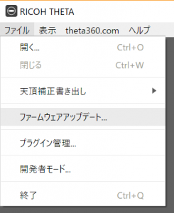
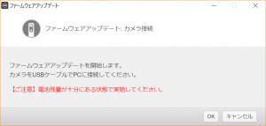
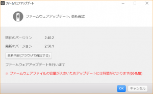
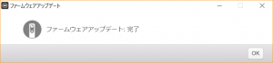
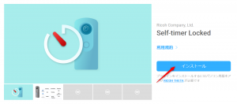
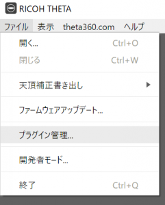
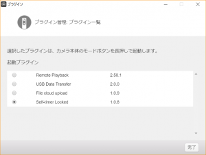
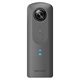

RICOH THETA Vはプラグインによる機能拡張を行うことができます（※ THETA V限定ですので注意）。

プラグインは一つだけ設定できて、modeボタン長押しで起動できます。もちろんプラグインの入れ替えは自由にできて自分の好きな機能にカスタマイズできるものです。

## プラグインの紹介

いくつか良さそうなプラグインを独断と偏見で紹介します。

### Self-timer locked（セルフタイマー固定）

 [https://github.com/ricohapi/theta-plugins/blob/main/plugins/com.theta360.selftimerlocked/README.ja.md](https://github.com/ricohapi/theta-plugins/blob/main/plugins/com.theta360.selftimerlocked/README.ja.md)

タイトルはセルフタイマー固定ですが、固定というかセルフタイマーモードの切り替えショートカットとして使えます。

これまで、セルフタイマーモードにするには、「WiFiボタン押しながら電源ボタンON」という起動ショートカットや、スマホと接続してモード切替するしかなかったのですが、第三の選択肢となります。既に電源を入れた状態でセルフタイマーに切り替えられるのは地味に便利ですし、水中ハウジングケースを装着した状態では唯一のセルフタイマー起動方法だったりします。

私はこのプラグインを入れています。水中撮影では必携かなと思いました。 [RICHO THETA Vの防水ハウジングケースの使い方と注意点](/life/waterproof-housing-case-of-theta)

### File Cloud Upload（クラウドアップロード）

 [https://github.com/ricohapi/theta-plugins/blob/main/plugins/com.theta360.clouduploadv2/README.ja.md](https://github.com/ricohapi/theta-plugins/blob/main/plugins/com.theta360.clouduploadv2/README.ja.md)

WiFiを通じてGoogleフォトにファイルアップロードができるようになるプラグインです。360°の写真や、特に動画は容量が大きいのでGoogleフォトなどのクラウド環境に保存することが多いと思います。本来はPCに一旦移してそこからアップロードという一手間があり、PCの容量の空きを気にしたりしなければならなかったり、単純に面倒だったりします。それを簡単にしてくれるのがこのプラグインです。 また、サードパーティ製プラグインの中に似たようなものとして、[FITA](https://github.com/ricohapi/theta-plugins/blob/main/plugins/com.everywoah.fitaplugin/README.ja.md)というものがあり、こちらはGoogle Cloudにアップロードできるもののようです。

## 使用方法

### 0\. 準備

以下の必要なものが揃っている前提で進めます。

- THETA V 本体
- インターネット接続されたPC
    - パソコン用基本ソフト（[https://support.theta360.com/ja/download/](https://support.theta360.com/ja/download/)）
- USBケーブル

### 1\. ファームウェアの最新化

まず、THETA本体のファームウェアバージョンが最新である必要がありますので、更新を行います。

1. PCとTHETAをUSBケーブルで接続します。
2. パソコン用基本ソフトでファームウェアアップデートを選択します。 OKを押下します。  次もOKを。  しばらく待っていると、ダウンロード→アップデート作業が完了します。 

### プラグインのダウンロード

1. 上記の紹介や、次のプラグインストアから対象のプラグインを探します。[plugins](https://github.com/ricohapi/theta-plugins/blob/main/README.ja.md)
2. プラグインのページでインストールを押下します。 この時、パソコン用基本ソフトは起動しておいてください。
3. OKを押下するとインストールが開始します。
4. ファイル→プラグイン管理を開くと、追加されたプラグインも表示されます。   ここでTHETA本体に適用したいプラグインを選択すればOKです。一度インストールしておけば、THETAを繋いで適用するだけの作業となります。

[RICOH THETA V 360度カメラ 全天球 910725 メタリックグレー](//af.moshimo.com/af/c/click?a_id=1041250&p_id=170&pc_id=185&pl_id=4062&s_v=b5Rz2P0601xu&url=https%3A%2F%2Fwww.amazon.co.jp%2Fexec%2Fobidos%2FASIN%2FB074ZB7PZM%2Fref%3Dnosim)

posted with [カエレバ](https://kaereba.com)

リコー 2017-09-15

[Amazon](//af.moshimo.com/af/c/click?a_id=1041250&p_id=170&pc_id=185&pl_id=4062&s_v=b5Rz2P0601xu&url=https%3A%2F%2Fwww.amazon.co.jp%2Fgp%2Fsearch%3Fkeywords%3Dtheta%2520v%26__mk_ja_JP%3D%25E3%2582%25AB%25E3%2582%25BF%25E3%2582%25AB%25E3%2583%258A)

[楽天市場](//af.moshimo.com/af/c/click?a_id=1041250&p_id=54&pc_id=54&pl_id=616&s_v=b5Rz2P0601xu&url=https%3A%2F%2Fsearch.rakuten.co.jp%2Fsearch%2Fmall%2Ftheta%2520v%2F-%2Ff.1-p.1-s.1-sf.0-st.A-v.2%3Fx%3D0)

## 参考

プラグイン説明ページ：[https://theta360.com/ja/ricoh\_plugins/](https://theta360.com/ja/ricoh_plugins/)

プラグインストア：[https://github.com/ricohapi/theta-plugins/blob/main/README.ja.md](https://github.com/ricohapi/theta-plugins/blob/main/README.ja.md)
