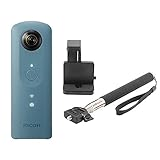

## 360°カメラはこんなに凄い！

話題の360°カメラを買いました！凄さについては百聞は一見に如かずです。以下に旅行時の写真を載せますので、その凄さを見て実感してください！これを見たら旅行には必携になること間違いなしです。

＜360°写真＞

> モルディブの白い砂浜 - [Spherical Image - RICOH THETA](https://theta360.com/s/rGnRCToqW5QNXAny80BUwV0J2)

＜星空も撮れます＞

> モルディブの満天の星空 - [Spherical Image - RICOH THETA](https://theta360.com/s/oZnlWsmU9CaxQ7pvbp0zQ3gsW)

＜動画も凄い＞

> モルディブでシュノーケリング - [Spherical Image - RICOH THETA](https://theta360.com/m/cWcJcfXKXcmdEGrRYAnLKfdBc)

## 主な仕様

RICOH製の同様な製品がいくつかあるので、比較も含めて表にしました。

|  | [THETA V](https://theta360.com/ja/about/theta/v.html) | [THETA S](https://theta360.com/ja/about/theta/s.html) | [THETA SC](https://theta360.com/ja/about/theta/sc.html) |
| --- | --- | --- | --- |
| 静止画解像度 | 5376×2688 | L：5376×2688、M：2048×1024 | L：5376×2688、M：2048×1024 |
| 動画解像度 | **4K，H264：3840×1920** **2K，H264：1920×960** | L：1920×1080 M：1280×720 | L：1920×1080 M：1280×720 |
| 動画フレームレート | **4K，H264：29.97fps** **2K，H264：29.97fps** | L：30fps M：15fps | L：30fps M：15fps |
| 動画ビットレート | **4K，H264：56Mbps** **2K，H264：16Mbps** | L：16Mbps M：6Mbps | L：16Mbps M：6Mbps |
| 動画最大録画時間 | **25分** | **25分** | 5分 |
| カラーバリエーション | メタリックグレー | ブラック | **ブルー、ベージュ、ピンク、ホワイト** |
| シャッタースピード |  **1/25000秒～60秒** | 1/6400秒～60秒 | 1/8000秒～60秒 |
| 内蔵メモリ |  **約19GB** | 約8GB | 約8GB |
| 重さ |  約121g | 約125g | **約102g** |
| 価格帯 | 約4万4000円 | 約2万9000円 | **約2万円** |

こちらの比較を見ていただくと分かる通り、theta vは動画性能が断トツに優れていて、私はこちらを買いました。上には載せていませんが、他にも細かな先進的な機能もたくさんあったりします。詳しくは公式サイト（[RICOH THETA V](https://theta360.com/ja/about/theta/v.html)）をご確認ください。

theta scは廉価版として出された後継モデルで、最低限の機能は有しつつかなりお買い求めやすくなりました。theta vの半額以下の金額設定と、カラーバリエーションが豊富なことから、RICOHとしては360°カメラを普及させようという姿勢が伺えますね。

theta sは位置づけとして中間に位置しています。ただ、私は中途半端かなと思いました。低価格を重視するのであればtheta scで、スペックを重視するのであればtheta vを選択すべきなのかなというイメージです。

[RICOH THETA V 360度カメラ 全天球 910725 メタリックグレー](//af.moshimo.com/af/c/click?a_id=1005555&p_id=170&pc_id=185&pl_id=4062&s_v=b5Rz2P0601xu&url=https%3A%2F%2Fwww.amazon.co.jp%2Fexec%2Fobidos%2FASIN%2FB074ZB7PZM%2Fref%3Dnosim)

posted with [カエレバ](https://kaereba.com)

リコー 2017-09-15

[Amazon](//af.moshimo.com/af/c/click?a_id=1005555&p_id=170&pc_id=185&pl_id=4062&s_v=b5Rz2P0601xu&url=https%3A%2F%2Fwww.amazon.co.jp%2Fgp%2Fsearch%3Fkeywords%3DRICOH%2520THETA%2520V%26__mk_ja_JP%3D%25E3%2582%25AB%25E3%2582%25BF%25E3%2582%25AB%25E3%2583%258A)

[楽天市場](//af.moshimo.com/af/c/click?a_id=1005555&p_id=54&pc_id=54&pl_id=616&s_v=b5Rz2P0601xu&url=https%3A%2F%2Fsearch.rakuten.co.jp%2Fsearch%2Fmall%2FRICOH%2520THETA%2520V%2F-%2Ff.1-p.1-s.1-sf.0-st.A-v.2%3Fx%3D0)

[Yahooショッピング](//ck.jp.ap.valuecommerce.com/servlet/referral?sid=3397016&pid=885197291&vc_url=http%3A%2F%2Fsearch.shopping.yahoo.co.jp%2Fsearch%3Fp%3DRICOH%2520THETA%2520V&vcptn=kaereba)

[RICOH デジタルカメラ RICOH THETA SC(ブルー) 360°全天球カメラ + ETSUMI 自撮り棒セット](//af.moshimo.com/af/c/click?a_id=1005555&p_id=170&pc_id=185&pl_id=4062&s_v=b5Rz2P0601xu&url=https%3A%2F%2Fwww.amazon.co.jp%2Fexec%2Fobidos%2FASIN%2FB06XGCG9XV%2Fref%3Dnosim)

posted with [カエレバ](https://kaereba.com)

リコー

[Amazon](//af.moshimo.com/af/c/click?a_id=1005555&p_id=170&pc_id=185&pl_id=4062&s_v=b5Rz2P0601xu&url=https%3A%2F%2Fwww.amazon.co.jp%2Fgp%2Fsearch%3Fkeywords%3DRICOH%2520THETA%2520SC%26__mk_ja_JP%3D%25E3%2582%25AB%25E3%2582%25BF%25E3%2582%25AB%25E3%2583%258A)

[楽天市場](//af.moshimo.com/af/c/click?a_id=1005555&p_id=54&pc_id=54&pl_id=616&s_v=b5Rz2P0601xu&url=https%3A%2F%2Fsearch.rakuten.co.jp%2Fsearch%2Fmall%2FRICOH%2520THETA%2520SC%2F-%2Ff.1-p.1-s.1-sf.0-st.A-v.2%3Fx%3D0)

[Yahooショッピング](//ck.jp.ap.valuecommerce.com/servlet/referral?sid=3397016&pid=885197291&vc_url=http%3A%2F%2Fsearch.shopping.yahoo.co.jp%2Fsearch%3Fp%3DRICOH%2520THETA%2520SC&vcptn=kaereba)

## 使用感

購入し、使ってみての（個人的な）感想です。細かいところを含めてメリット/デメリットを以下に綴ります。

### メリット

- とにかく360°の画像が凄い！綺麗！旅行の思い出として残すのに最高。
- レンタルが500円/1日とかでできる。
- 基本的なカメラとしての設定も可能なので、セルフタイマーで撮影したり、露光時間を長くしての星空撮影なども可能。
- 持ちやすい。軽い。
- 公式の共有サイトで簡単に写真を共有できる。操作も簡単でサクサク直感的に動かせる。
- youtube等の動画サイトは360°動画の再生に対応しており、簡単に（というかそのまま）アップロードできる。

### デメリット

- 公式の共有サイトでは、マイリストやフォルダみたいな管理ができないので、大量に写真を撮ると管理が難しい。
- 動画の共有において公式サイトは使い物にならない。5MBの制限があるため11秒程だけしかアップロードできない。
- 温度上昇で録画が止まる。これは仕様なのですが、電源つけっぱなしで写真を撮りまくってから動画撮影開始したりすると、発熱しすぎてしまいます。
- 保存領域は19GBありますが（THETA Vの場合）、360°画像/動画はかなり容量をとるので割とすぐになくなります。なので数日間の旅行の場合はPCに移動などする必要があります。

## 終わりに

トータルとして、凄く良い買い物をしたと思っています。この感動が伝わればよいのですが。上手く書き表せていない気持ちもあるので、適宜追記したり、別の記事を上げたりすると思います。
