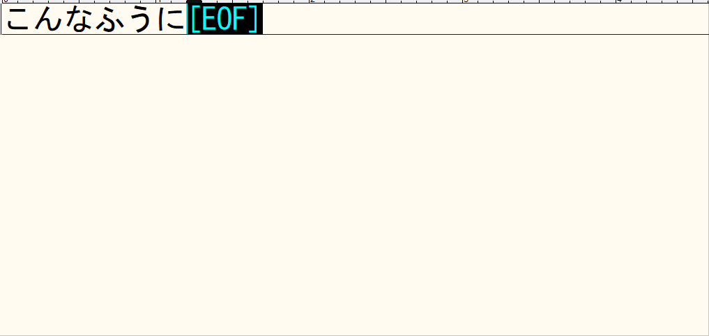
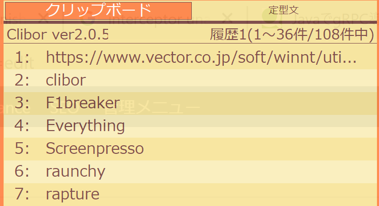
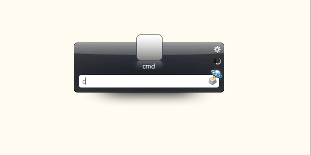
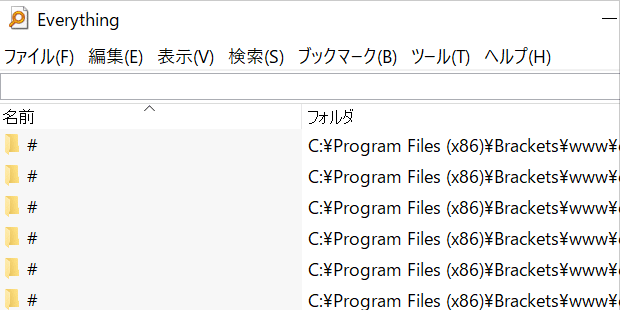

私が思うWindows環境には必須の便利ツールをご紹介します。

## Rapture

画面を切り取り、付箋のように全面に出し続けてくれるツールです。一部だけ表示しておきつつ作業がしたいなーというときにとても便利です。

<figure>

<figcaption>

Rapture使用イメージ

</figcaption>

</figure>

https://www.vector.co.jp/soft/win95/art/se386376.html

## Clibor

クリップボード履歴管理ツールの定番です。コピーした文字列を何個も保持しているので、何個もコピー&ペーストする場合に一々コピーしなおさずとも履歴から選択して貼り付けられます。また、定型文設定もできますので、よく使う文字列はそこに設定しておくと大変便利です。

<figure>

<figcaption>

Cliborの起動キャプチャ

</figcaption>

</figure>

https://www.vector.co.jp/soft/winnt/util/se472890.html

## Launchy

キーボード入力のランチャーソフトです。使用したいソフトウェア名を入力すると起動することができます。一々ショートカットなどを探しに行かずとも起動できるのは慣れるととても便利です。

<figure>

<figcaption>

Launchy使用イメージ

</figcaption>

</figure>

https://www.vector.co.jp/soft/winnt/util/se493194.html

## Screenpresso

汎用のスクリーンショットツール。Windows標準のスクリーンショットでは画面全体を撮るだけですが、Screenpressoでは画面範囲を指定してキャプチャすることもできますし、キャプチャ後にちょっとした編集も可能なので「画面のここが～」といったことを示したい時にとても便利です。

<figure>

<figcaption>

Screenpresso使用イメージ

</figcaption>

</figure>

https://www.screenpresso.com/ja/

## Everything

汎用のファイル検索ツールです。Windows標準の検索はかなり遅かったりするのですが、Everythingでは高速にファイル名から検索してくれます。

<figure>

<figcaption>

Everthing使用イメージ

</figcaption>

</figure>

https://forest.watch.impress.co.jp/library/software/everything/

## F1breaker

F1（ファンクション1）キーを無効にするただそれだけのツール。多くの場合、F1キーにはヘルプなどが開くショートカットが設定されていますが、あまりヘルプを使わないのと起動が遅かったりで、「Escapeキーと間違って押してしまった！」という時のイライラをなくせます。（精神衛生上とても役立ってます。）

https://www.inasoft.org/f1break.html

## おわりに

ここで挙げたものは選りすぐりのツール達です。ぜひ試してみてください。
