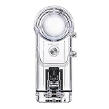
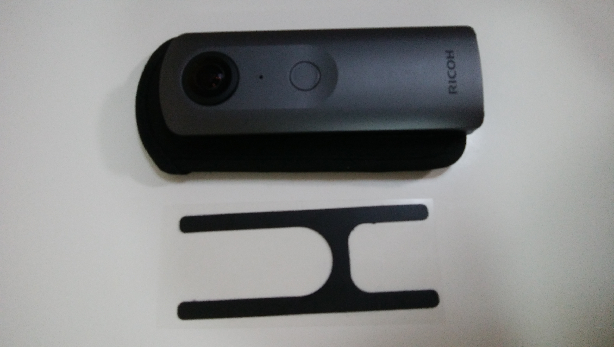
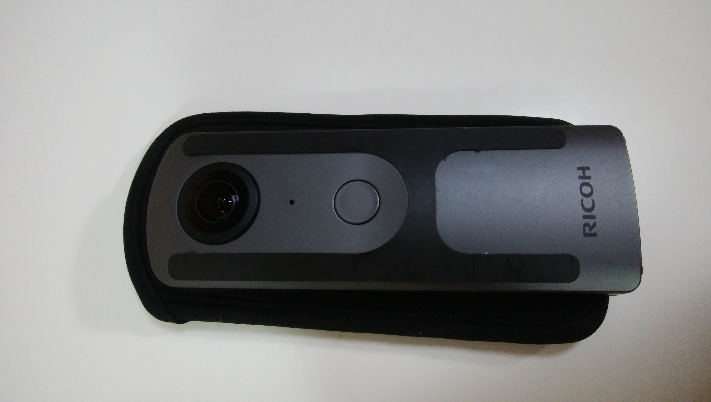
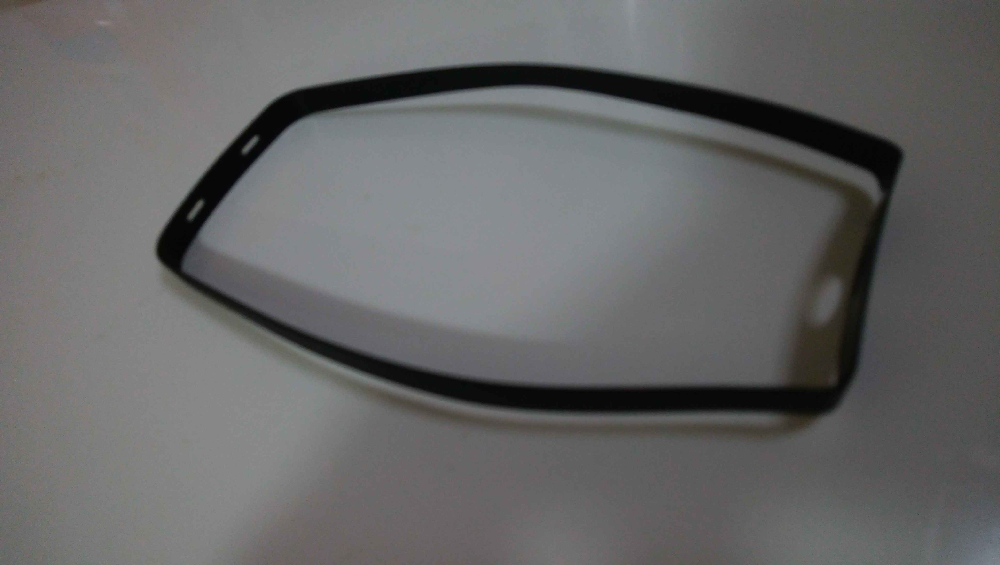
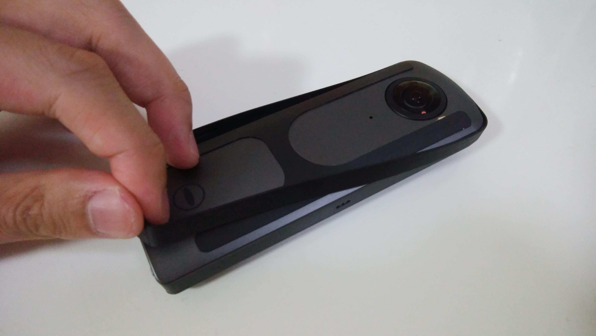
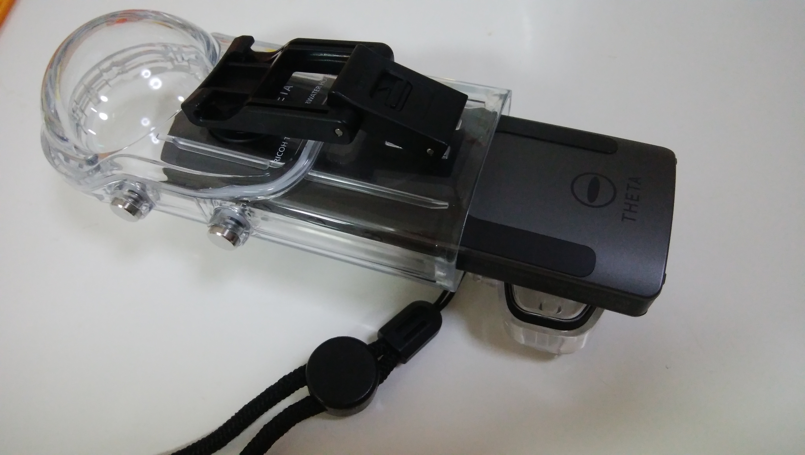
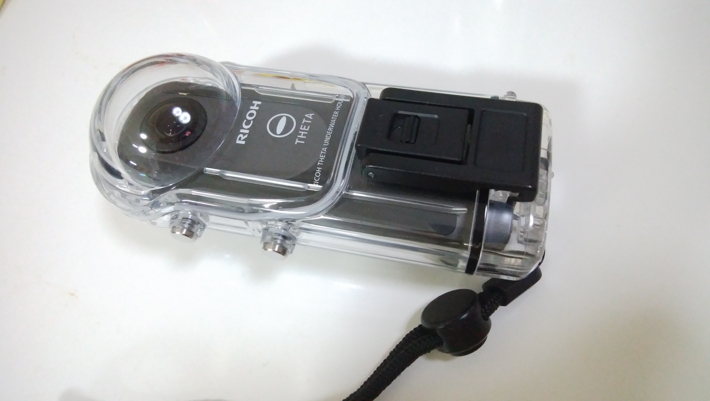

360°カメラで水中写真を撮ってみたい！、、、だけど少し高いから使用感なんかを事前によく知りたい人や、説明書をよく読まなくて使い方がわからない人（私がそうでした^^;）、そんな方々向けにこの記事を書こうと思います。

## 使用準備

[RICOH TW-1 水中ハウジングケース 910753](//af.moshimo.com/af/c/click?a_id=1041250&p_id=170&pc_id=185&pl_id=4062&s_v=b5Rz2P0601xu&url=https%3A%2F%2Fwww.amazon.co.jp%2Fexec%2Fobidos%2FASIN%2FB074ZD2NFW%2Fref%3Dnosim)

posted with [カエレバ](https://kaereba.com)

リコー 2017-11-24

[Amazon](//af.moshimo.com/af/c/click?a_id=1041250&p_id=170&pc_id=185&pl_id=4062&s_v=b5Rz2P0601xu&url=https%3A%2F%2Fwww.amazon.co.jp%2Fgp%2Fsearch%3Fkeywords%3Dtheta%2520%25E9%2598%25B2%25E6%25B0%25B4%25E3%2583%258F%25E3%2582%25A6%25E3%2582%25B8%25E3%2583%25B3%25E3%2582%25B0%25E3%2582%25B1%25E3%2583%25BC%25E3%2582%25B9%26__mk_ja_JP%3D%25E3%2582%25AB%25E3%2582%25BF%25E3%2582%25AB%25E3%2583%258A)

[楽天市場](//af.moshimo.com/af/c/click?a_id=1041250&p_id=54&pc_id=54&pl_id=616&s_v=b5Rz2P0601xu&url=https%3A%2F%2Fsearch.rakuten.co.jp%2Fsearch%2Fmall%2Ftheta%2520%25E9%2598%25B2%25E6%25B0%25B4%25E3%2583%258F%25E3%2582%25A6%25E3%2582%25B8%25E3%2583%25B3%25E3%2582%25B0%25E3%2582%25B1%25E3%2583%25BC%25E3%2582%25B9%2F-%2Ff.1-p.1-s.1-sf.0-st.A-v.2%3Fx%3D0)

### 装着物をセッティングする

#### 保護シート（必須）

THETA本体に貼り付けるH型のシート（シール）が2枚付属していますので、両面に貼ります。こちらはハウジングケースに入れる際の傷を防止するという目的でありますが、このシールを貼った状態でのサイズで設計されていますので、**貼らないとケースのボタンを押したときに本体側のシャッターボタン押下ができなくなります**。1ミリも無いような厚さが足りないだけですが、シャッター押せないのはかなり致命的で焦りました。皆さんは気をつけてください。事前に試し撮りしておきましょう。 貼付け前  貼付け後

**写真にはありませんが、両面貼り付けてください。**

#### 保護カバー（THETA Sの場合のみ）

これはTHETAのシリーズによって色々と大きさが異なるのでそのサイズ調整のためのカバーです。THETA V自体にカバーを着けることはできますが、ハウジングケースに入らなくなります。決して無理に入れようとしないようにしてください。

### ハウジングケースに入れる

装着物を装備したTHETA本体をケースに入れます。**特に球体レンズが擦れて傷つかないように慎重に入れましょう**。

入れ終わったらフックをカチッとはめます。

## 使用時の制約

基本的な使用方法は同じですが、いくつか制約事項があります。これらを踏まえた上でご購入の検討をしていただければと。私の所感としては慣れれば特段不便を感じませんが、痒いところに手が届かず、惜しいなと感じました。

### 制約1 タイマー撮影がし難くなる(wifi切り替えボタンが使えない)

写真を見てもらえれば分かりますが、そもそもケースにボタンが用意されていないので使えないのは当然といえば当然です。後述しますが、そもそもwifiを使用してTHETAとスマホを水中で接続するのは難しいのでwifiボタン自体は使えなくても不便はありません。しかし、タイマーモードにしたい場合の、ショートカットである「Wifiボタン押しながら電源ON」が使用できなくなります。タイマー撮影がし難くなるというのが制約事項の一つです。

追記：プラグイン機能を用いることで、この制約は解消できました。下記参照。

[http://localhost/life/theta360-plugin](http://localhost/life/theta360-plugin)

### 制約2 水中ではリモート接続できない

THETAやスマホが水中にあるとリモート接続が切断されてしまいます。これは機能上の制約というよりも、そもそも電波そのものの性質として、水中と空気中では伝わり方が異なるので、物理上しかたのない話ではあります。ですので、どうしてもマニュアル操作したい場合やセルフタイマーに切り替えたい場合には、両方を空気中に出したままリモート接続して、水中ではボタン操作するということをする必要があります。

これ故、THETAのマニュアル操作での水中撮影も難しいということです。露光時間やISO感度の調整なんかを都度変えるということは難しくなります。

### 制約3 音が聴こえない

これは気密性の高いケースに入っているので当然ですが、本体の操作音（シャッター音など）は聴こえにくいです。逆に、ビデオ撮影時も音が記録されにくいです。水中だとボコボコ音だけしか聞こえないものと思ってもらえればと思います。
